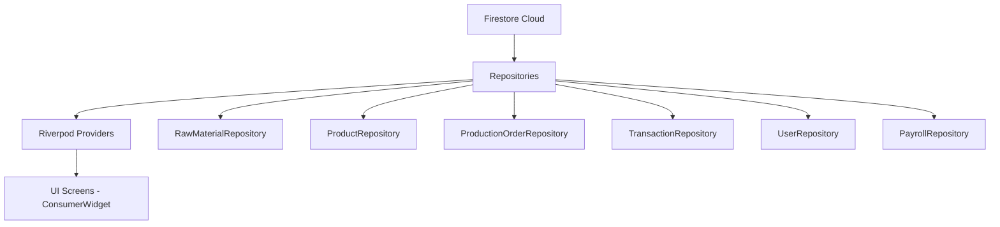

# Walkthrough: Firebase Firestore Integration — Rumah Jahit

## Summary

Berhasil mengintegrasikan backend Cloud Firestore ke seluruh modul aplikasi konveksi. Semua screen yang sebelumnya menggunakan data dummy kini terhubung ke Firestore secara **real-time** via `StreamProvider`.

---

## Architecture

## Files Created (26 new files)

### Domain Models (6 files)
| File | Collection |
|------|-----------|
| [raw_material.dart](file:///e:/Code/Flutter/rumah_jahit/lib/features/inventory/domain/raw_material.dart) | `raw_materials` |
| [product.dart](file:///e:/Code/Flutter/rumah_jahit/lib/features/inventory/domain/product.dart) | `products` |
| [production_order.dart](file:///e:/Code/Flutter/rumah_jahit/lib/features/inventory/domain/production_order.dart) | `production_orders` |
| [transaction_model.dart](file:///e:/Code/Flutter/rumah_jahit/lib/features/pos/domain/transaction_model.dart) | `transactions` |
| [app_user.dart](file:///e:/Code/Flutter/rumah_jahit/lib/features/payroll/domain/app_user.dart) | `users` |
| [payroll_record.dart](file:///e:/Code/Flutter/rumah_jahit/lib/features/payroll/domain/payroll_record.dart) | `payroll_records` |

### Repositories (6 files)
| File | Key Methods |
|------|------------|
| [raw_material_repository.dart](file:///e:/Code/Flutter/rumah_jahit/lib/features/inventory/data/raw_material_repository.dart) | [watchAll()](file:///e:/Code/Flutter/rumah_jahit/lib/features/inventory/data/production_order_repository.dart#8-17), [add()](file:///e:/Code/Flutter/rumah_jahit/lib/features/inventory/data/production_order_repository.dart#41-45), [deductStock()](file:///e:/Code/Flutter/rumah_jahit/lib/features/inventory/data/raw_material_repository.dart#38-45) |
| [product_repository.dart](file:///e:/Code/Flutter/rumah_jahit/lib/features/inventory/data/product_repository.dart) | [watchAll()](file:///e:/Code/Flutter/rumah_jahit/lib/features/inventory/data/production_order_repository.dart#8-17), [addBatch()](file:///e:/Code/Flutter/rumah_jahit/lib/features/inventory/data/product_repository.dart#28-37), [deductStock()](file:///e:/Code/Flutter/rumah_jahit/lib/features/inventory/data/raw_material_repository.dart#38-45) |
| [production_order_repository.dart](file:///e:/Code/Flutter/rumah_jahit/lib/features/inventory/data/production_order_repository.dart) | [watchAll()](file:///e:/Code/Flutter/rumah_jahit/lib/features/inventory/data/production_order_repository.dart#8-17), [watchActive()](file:///e:/Code/Flutter/rumah_jahit/lib/features/inventory/data/production_order_repository.dart#18-28), [complete()](file:///e:/Code/Flutter/rumah_jahit/lib/features/inventory/data/production_order_repository.dart#59-67) |
| [transaction_repository.dart](file:///e:/Code/Flutter/rumah_jahit/lib/features/pos/data/transaction_repository.dart) | [createTransaction()](file:///e:/Code/Flutter/rumah_jahit/lib/features/pos/data/transaction_repository.dart#9-38) (atomic batch), [watchToday()](file:///e:/Code/Flutter/rumah_jahit/lib/features/pos/data/transaction_repository.dart#39-55) |
| [user_repository.dart](file:///e:/Code/Flutter/rumah_jahit/lib/features/payroll/data/user_repository.dart) | [watchAll()](file:///e:/Code/Flutter/rumah_jahit/lib/features/inventory/data/production_order_repository.dart#8-17), [watchEmployees()](file:///e:/Code/Flutter/rumah_jahit/lib/features/payroll/data/user_repository.dart#22-30) |
| [payroll_repository.dart](file:///e:/Code/Flutter/rumah_jahit/lib/features/payroll/data/payroll_repository.dart) | [watchByUser()](file:///e:/Code/Flutter/rumah_jahit/lib/features/payroll/data/payroll_repository.dart#7-17), [generate()](file:///e:/Code/Flutter/rumah_jahit/lib/features/payroll/data/payroll_repository.dart#29-33) |

### Providers (5 files)
| File | Key Providers |
|------|--------------|
| [inventory_providers.dart](file:///e:/Code/Flutter/rumah_jahit/lib/features/inventory/data/inventory_providers.dart) | `rawMaterialsStreamProvider`, `productsStreamProvider`, `productionOrdersStreamProvider` |
| [pos_providers.dart](file:///e:/Code/Flutter/rumah_jahit/lib/features/pos/data/pos_providers.dart) | `filteredProductsProvider`, `selectedFilterProvider`, `todayTransactionsProvider` |
| [cart_notifier.dart](file:///e:/Code/Flutter/rumah_jahit/lib/features/pos/data/cart_notifier.dart) | `cartProvider` (StateNotifier with add/remove/clear) |
| [payroll_providers.dart](file:///e:/Code/Flutter/rumah_jahit/lib/features/payroll/data/payroll_providers.dart) | `employeesStreamProvider`, `payrollByUserProvider` |
| [dashboard_providers.dart](file:///e:/Code/Flutter/rumah_jahit/lib/features/dashboard/data/dashboard_providers.dart) | `todayRevenueProvider`, `dashboardLowStockProvider` |

### UI Forms (2 new files)
| File | Purpose |
|------|---------|
| [add_raw_material_dialog.dart](file:///e:/Code/Flutter/rumah_jahit/lib/features/inventory/presentation/widgets/add_raw_material_dialog.dart) | Form tambah bahan mentah |
| [add_product_form.dart](file:///e:/Code/Flutter/rumah_jahit/lib/features/inventory/presentation/widgets/add_product_form.dart) | Form tambah produk (multi-size auto-expand) |

## Files Modified (7 files)

| File | Change |
|------|--------|
| [bahan_mentah_tab_view.dart](file:///e:/Code/Flutter/rumah_jahit/lib/features/inventory/presentation/widgets/bahan_mentah_tab_view.dart) | `StatelessWidget` → `ConsumerWidget` + Firestore stream |
| [barang_jadi_tab_view.dart](file:///e:/Code/Flutter/rumah_jahit/lib/features/inventory/presentation/widgets/barang_jadi_tab_view.dart) | `StatelessWidget` → `ConsumerWidget` + product grouping |
| [spk_tab_view.dart](file:///e:/Code/Flutter/rumah_jahit/lib/features/inventory/presentation/widgets/spk_tab_view.dart) | `StatelessWidget` → `ConsumerWidget` + dynamic metrics |
| [pos_screen.dart](file:///e:/Code/Flutter/rumah_jahit/lib/features/pos/presentation/pos_screen.dart) | `StatefulWidget` → `ConsumerStatefulWidget` + cart + filter |
| [checkout_screen.dart](file:///e:/Code/Flutter/rumah_jahit/lib/features/pos/presentation/checkout_screen.dart) | `StatelessWidget` → `ConsumerStatefulWidget` + atomic payment |
| [payroll_screen.dart](file:///e:/Code/Flutter/rumah_jahit/lib/features/payroll/presentation/payroll_screen.dart) | `StatelessWidget` → `ConsumerWidget` + live employees |
| [dashboard_screen.dart](file:///e:/Code/Flutter/rumah_jahit/lib/features/dashboard/presentation/dashboard_screen.dart) | `StatelessWidget` → `ConsumerWidget` + live metrics |

## Verification

`flutter analyze` passed with **0 errors, 0 warnings**. Only 23 `info`-level hints (pre-existing `withOpacity` deprecation and minor style hints).

## Next Steps

> [!TIP]
> Jalankan `flutter run` untuk menguji. Data Firestore awalnya kosong — gunakan form "Tambah Bahan Mentah" dan "Tambah Produk" untuk mengisi data pertama kali.
